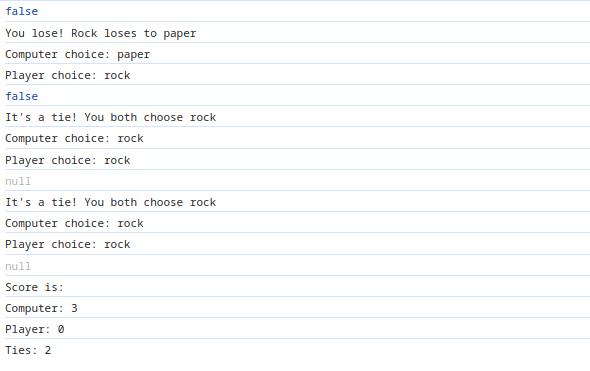

# Rock Paper Scissors

The program asks the user to input 5 strings (Rock, Paper or Scissors).
in the meantime the computer generates 5 different values that translate
to the corresponding string.

After each input the console prints out what the player picked and what
the computer picked as well as whether you won or lost and the reason.

In the end the program also displays the score you had vs the computer
(How many times you won, lost and tied the round).

